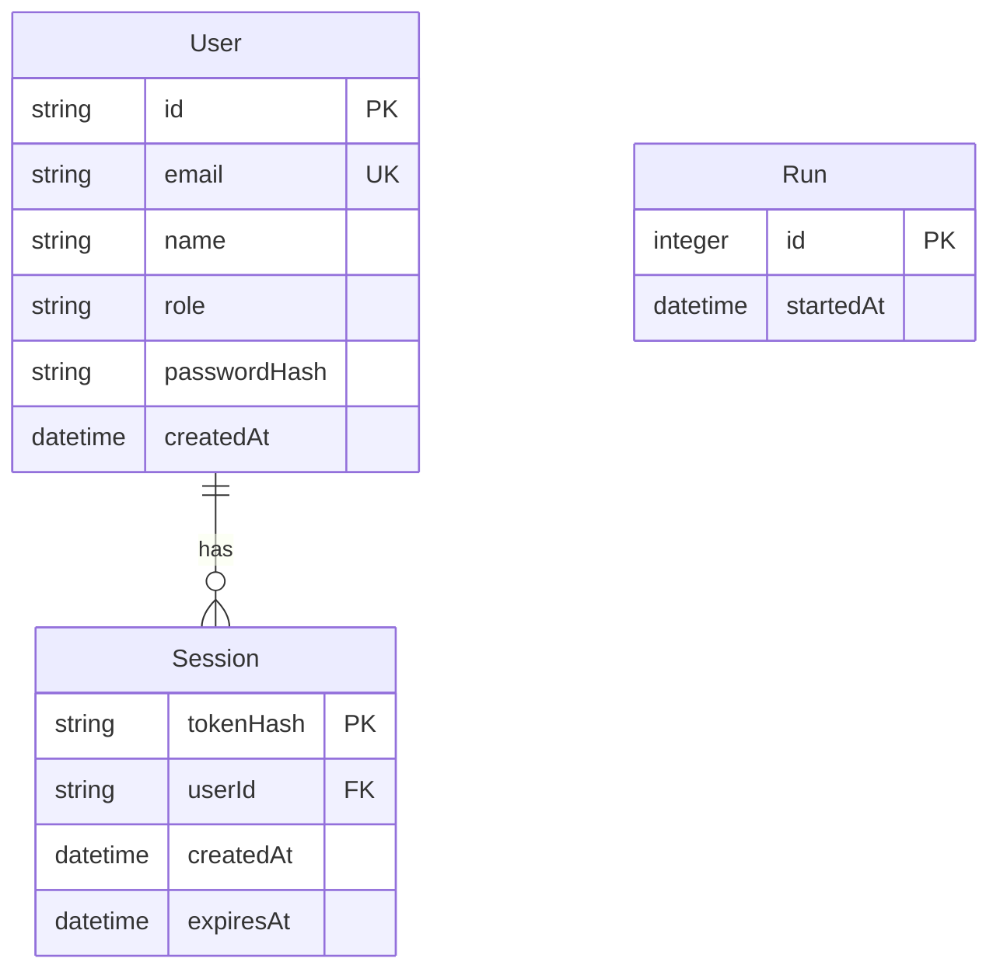

# Model schema — Archetype Base

## Entity-Relationship diagram

## Entities

- **User** — One registered account. Its email is unique and lower case. Its role is `user`. Its password is stored as a salted hash.
- **Session** — One authenticated session of a user. It stores a token hash and an expiry time. Logout removes one session.
- **Run** — One startup of the API. The health feature counts these records. The physical column `started_at` holds `startedAt`.

`schema_versions` is a technical table, not a domain entity.
The API owns all persisted entities.
The archetypes carry no business entity.

---

> last updated: 2026-10-08T14:04:00+02:00
